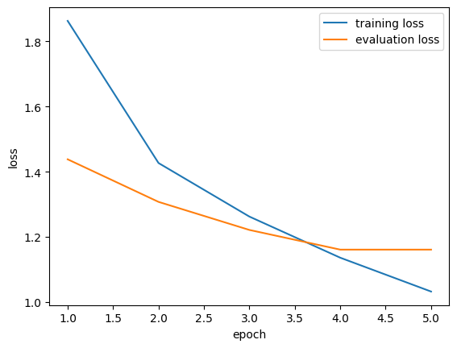
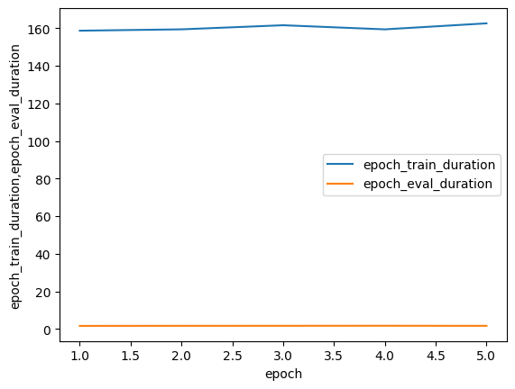

# NLP Examples Guide

This guide explores Natural Language Processing (NLP) experiments using `ml-runner`. We compare three major Recurrent Neural Network (RNN) architectures across two common tasks: **Machine Translation** and **Text Generation**.

---

## Models & Architectures

In these experiments, we use three variations of Recurrent Neural Networks to handle sequential data:

### 1. RNN (Recurrent Neural Network)

The simplest form of a sequential model. It processes information step-by-step, but often suffers from the **vanishing gradient problem**, making it difficult to remember information from far back in a sentence.

### 2. LSTM (Long Short-Term Memory)

A more advanced RNN that uses "gates" to control the flow of information. It can learn long-range dependencies by deciding which information to keep and which to forget.

### 3. GRU (Gated Recurrent Unit)

A simplified version of the LSTM that is often faster to train while achieving similar performance. It merges the cell state and hidden state, making it more computationally efficient.

---

## Datasets

We use two primary datasets for our NLP tasks:

- **Multi30k**: A dataset of 30,000 images with captions in multiple languages (we use German to English). Ideal for **Machine Translation**.
- **WikiText2**: A collection of high-quality Wikipedia articles. Used for **Text Generation** (Language Modeling).

---

## Techniques & Metrics

### Embedding Strategies

- **One-Hot Encoding**: Triggered by setting `emb_dim: 0` in the configuration. The backend uses `torch.nn.functional.one_hot` to convert word indices into binary vectors. This represents words as high-dimensional, sparse vectors where only one element is "1".
- **Embeddings**: When `emb_dim > 0`, the model uses a `torch.nn.Embedding` layer. This maps each word to a dense, lower-dimensional vector that the model learns during training.
- **Pretrained (GloVe)**: A type of dense embedding where the vectors are initialized using pre-calculated word weights (e.g., from Global Vectors for Word Representation). This provides the model with semantic knowledge before training even begins.

### Key Metrics

- **Loss (Cross-Entropy)**: Measures the distance between predicted probabilities and actual words. Lower is better.
- **Perplexity**: A measurement of how "surprised" a model is by new data. It's mathematically defined as $2^{H(p)}$, where $H(p)$ is the entropy. Lower perplexity means better prediction.
- **BLEU Score**: A metric for evaluating machine translation by comparing the model's output to human-provided reference translations. Scores range from 0 to 100, where higher is better.

---

## Performance Comparisons

We compared RNN, LSTM, and GRU architectures across both tasks. Below are the results for one-hot encoded models after 5 epochs of training.

### Machine Translation (Multi30k)

| Model | Val Loss | Perplexity | BLEU |
| :--- | :---: | :---: | :---: |
| **RNN** | 1.31 | 3.72 | 88.95 |
| **LSTM** | 1.27 | 3.56 | 89.17 |
| **GRU** | 1.16 | 3.20 | 89.81 |

**Analysis**:

- The **GRU** performed the best in terms of BLEU score and loss on this dataset.
- The **RNN** lagged slightly behind, likely due to the difficulty in maintaining long-term dependencies compared to gated architectures like LSTM and GRU.


*Figure 1: Training and Validation Loss for the GRU model.*

### Text Generation (WikiText2)

| Model | Val Loss | Perplexity | Epoch Duration |
| :--- | :---: | :---: | :---: |
| **RNN** | 4.92 | 139.31 | 37.98s |
| **LSTM** | 5.07 | 162.01 | 53.45s |
| **GRU** | 5.06 | 160.94 | 49.23s |

**Analysis**:

- Interestingly, the simple **RNN** achieved the lowest perplexity on this specific configuration of the WikiText2 task, though it was slightly less complex than the MT task.
- Gated models (LSTM/GRU) often require more epochs to fully converge on complex language modeling tasks compared to simpler translation tasks.

---

## Runtime Analysis

Understanding the trade-off between model complexity and training speed is crucial for scaling experiments.

### Training Speed (per Epoch)

| Embedding | Model | Task | Duration |
| :--- | :---: | :---: | :---: |
| One-Hot | RNN | MT | 122.40s |
| One-Hot | LSTM | MT | 185.15s |
| One-Hot | GRU | MT | 162.58s |
| Pretrained | GRU | MT | 105.00s |

**Key Takeaways**:

1.  **Model Complexity**: LSTMs are the most computationally expensive due to their four-gate architecture, followed by GRUs (three gates) and then simple RNNs.
2.  **Embedding Impact**: Using **Pretrained Embeddings** is significantly faster (105s vs 162s for GRU). This is because the input dimension is reduced from the vocabulary size (thousands of dimensions in one-hot) to a dense vector (e.g., 50 dimensions), leading to much smaller matrix multiplications in the first layer.


*Figure 2: Breakdown of training vs. evaluation time for the GRU model.*

---

## Try It Yourself

You can reproduce these experiments using the provided configurations:

```bash
# Run Machine Translation with GRU and One-Hot embeddings
ml-runner run -c examples/nlp/gru_mt_onehot.yml

# Run Text Generation with LSTM and Pretrained embeddings
ml-runner run -c examples/nlp/lstm_text_gen_pretrained.yml
```

Explore the `examples/nlp/` directory to see how these models are configured!
