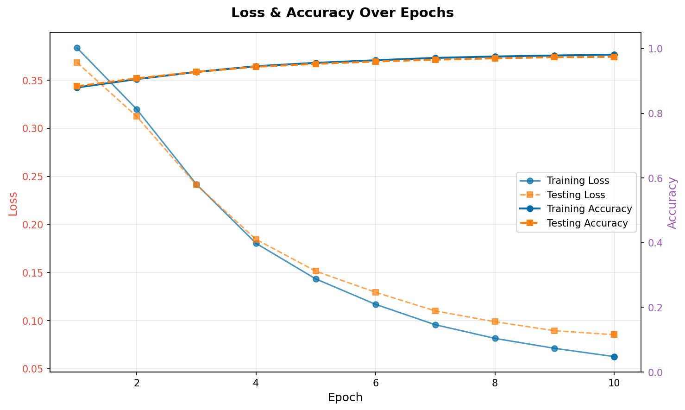
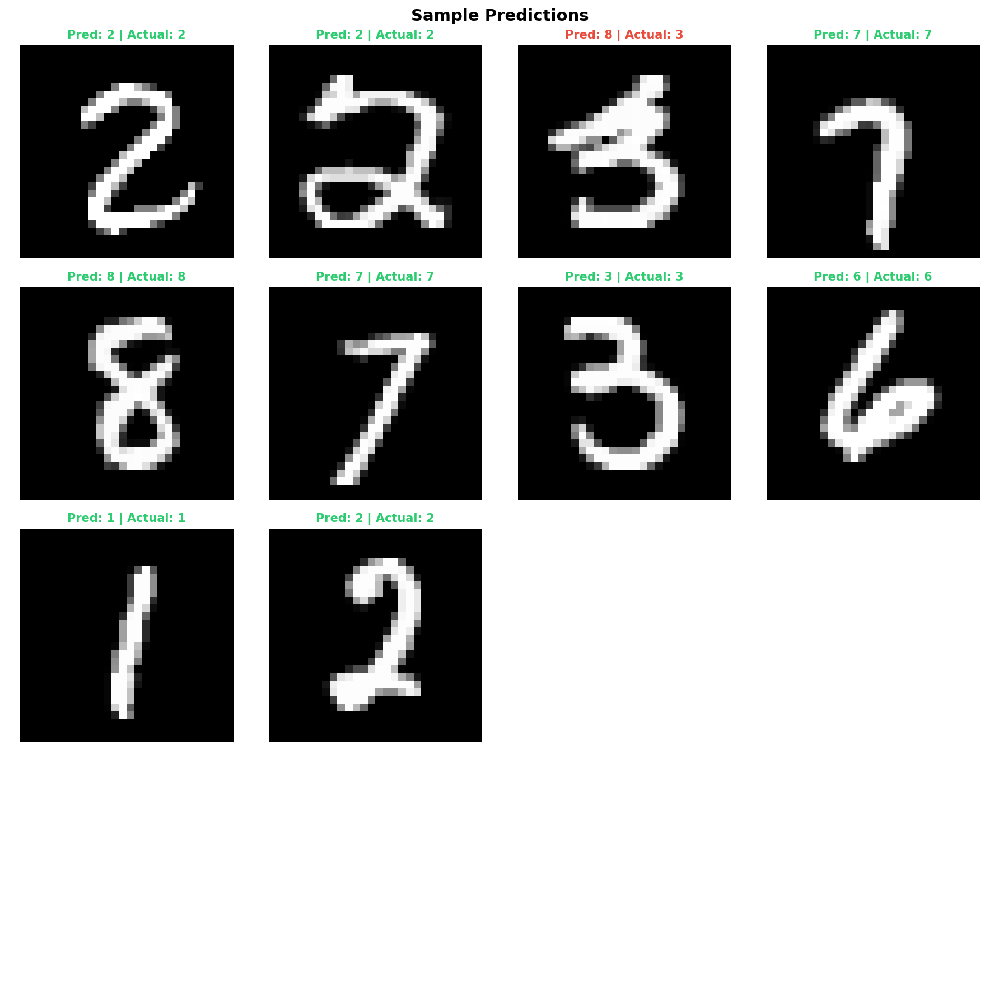
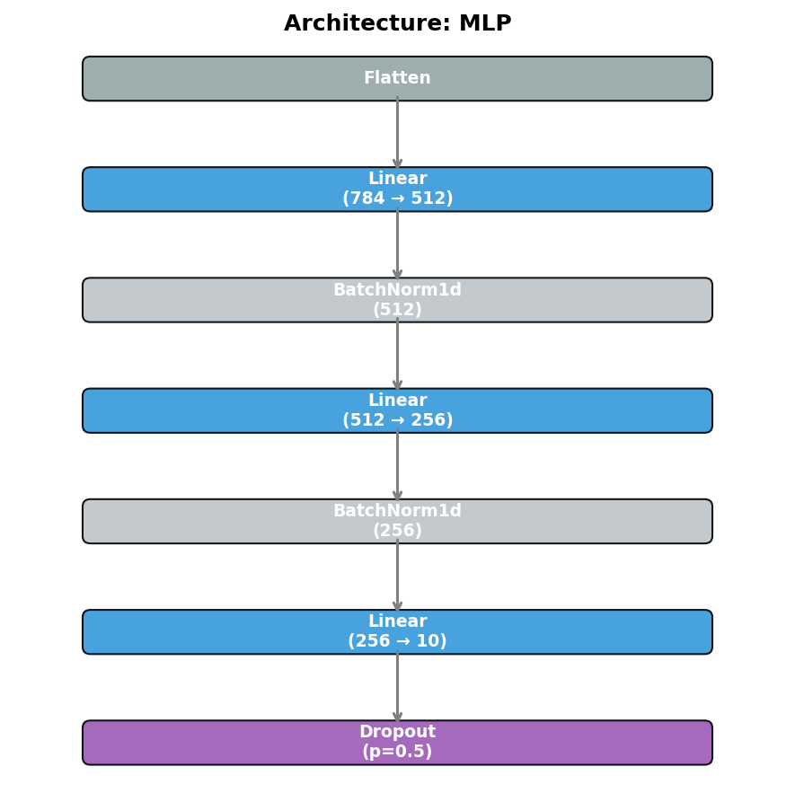

# MNIST Handwritten Digits

The MNIST dataset consists of 60,000 training images and 10,000 testing images of handwritten digits (0-9). Each image is 28x28 pixels in grayscale.

## Configurations

This example uses three different model architectures. All configurations inherit from `mnist_base.py`, which handles dataset loading and normalization using a mean of `0.1307` and standard deviation of `0.3081`.

### 1. Multi-Layer Perceptron (MLP)

- **Config:** `mnist_mlp.py`
- **Features:** A simple two-layer fully connected network.
- **Performance:** Achieves >90% accuracy quickly.
- **Command:**

  ```bash
  cd examples/MNIST
  python ../../main.py job --config mnist_mlp.py
  ```

### 2. Convolutional Neural Network (CNN)

- **Config:** `mnist_cnn.py`
- **Features:** A traditional CNN architecture designed for spatial feature extraction.
- **Performance:** Higher accuracy than MLP with fewer parameters.
- **Command:**

  ```bash
  cd examples/MNIST
  python ../../main.py job --config mnist_cnn.py
  ```

### 3. Vision Transformer (ViT)

- **Config:** `mnist_vit.py`
- **Features:** A modern transformer-based approach for image classification, using 4x4 patches. Very quickly reaches good accuracy on such a simple dataset.
- **Command:**

  ```bash
  cd examples/MNIST
  python ../../main.py job --config mnist_vit.py
  ```

## Visualizations

After running a job, you can generate visualizations:

```bash
python ../../main.py vis --config mnist_mlp.py
```

### Metrics & Predictions

| Training Progress | Sample Predictions |
| :---: | :---: |
|  |  |

### Model Architecture


