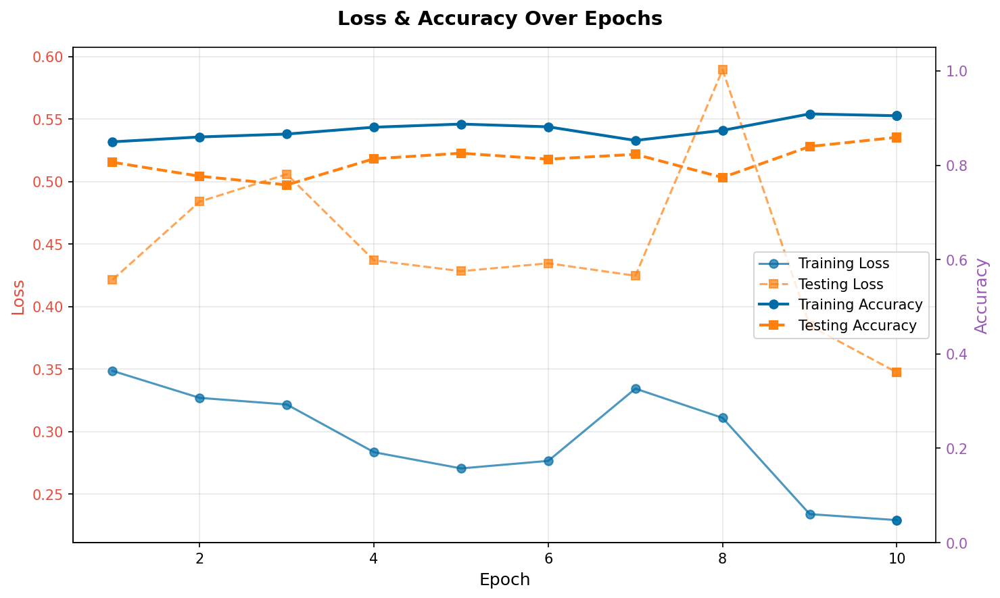
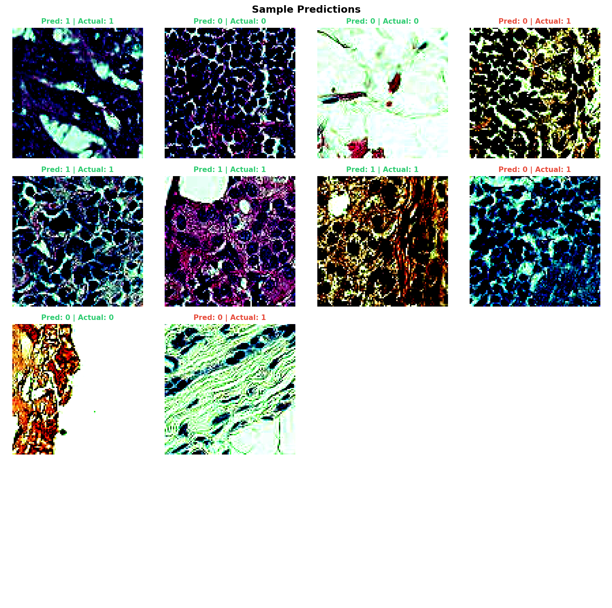
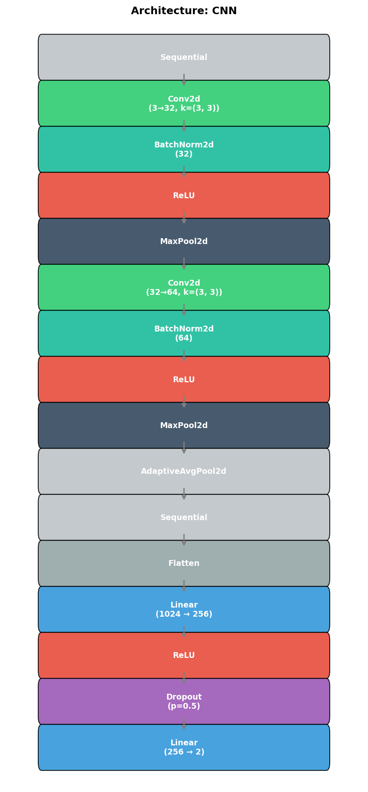

# Patch Camelyon Medical Imaging

The PatchCamelyon (PCAM) dataset consists of 327,680 color images (96 x 96 pixels) extracted from histopathologic scans of lymph node sections. Each image is labeled as either containing metastatic tissue (tumor) or not.

## Configurations

All configurations inherit from `pcam_base.py`. Note that PCAM uses a `split` argument (`train`, `test`) instead of the standard `train=True/False` in its PyTorch Dataset implementation.

### 1. Multi-Layer Perceptron (MLP)

- **Config:** `pcam_mlp.py`
- **Details:** A simple MLP applied to the flattened 96x96x3 input. Surprisingly effective for binary classification but computationally expensive.
- **Command:**

  ```bash
  cd examples/PatchCamelyon
  python ../../main.py job --config pcam_mlp.py
  ```

### 2. Convolutional Neural Network (CNN)

- **Config:** `pcam_cnn.py`
- **Details:** Well-suited for medical imaging due to its ability to detect structural anomalies in the tissue scans.
- **Command:**

  ```bash
  cd examples/PatchCamelyon
  python ../../main.py job --config pcam_cnn.py
  ```

### 3. Vision Transformer (ViT)

- **Config:** `pcam_vit.py`
- **Details:** Uses 8x8 patches and a deeper transformer stack (8 layers) to capture global dependencies in the large 96x96 images.
- **Command:**

  ```bash
  cd examples/PatchCamelyon
  python ../../main.py job --config pcam_vit.py
  ```

## Visualizations

```bash
python ../../main.py vis --config pcam_cnn.py
```

### Metrics & Predictions

| Training Progress | Sample Predictions |
| :---: | :---: |
|  |  |

### Model Architecture


