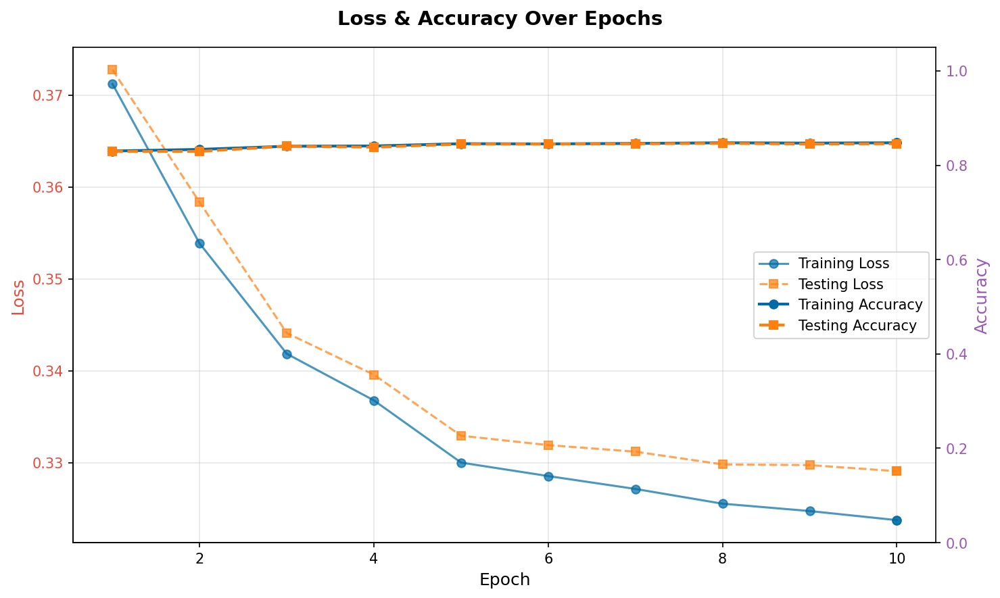
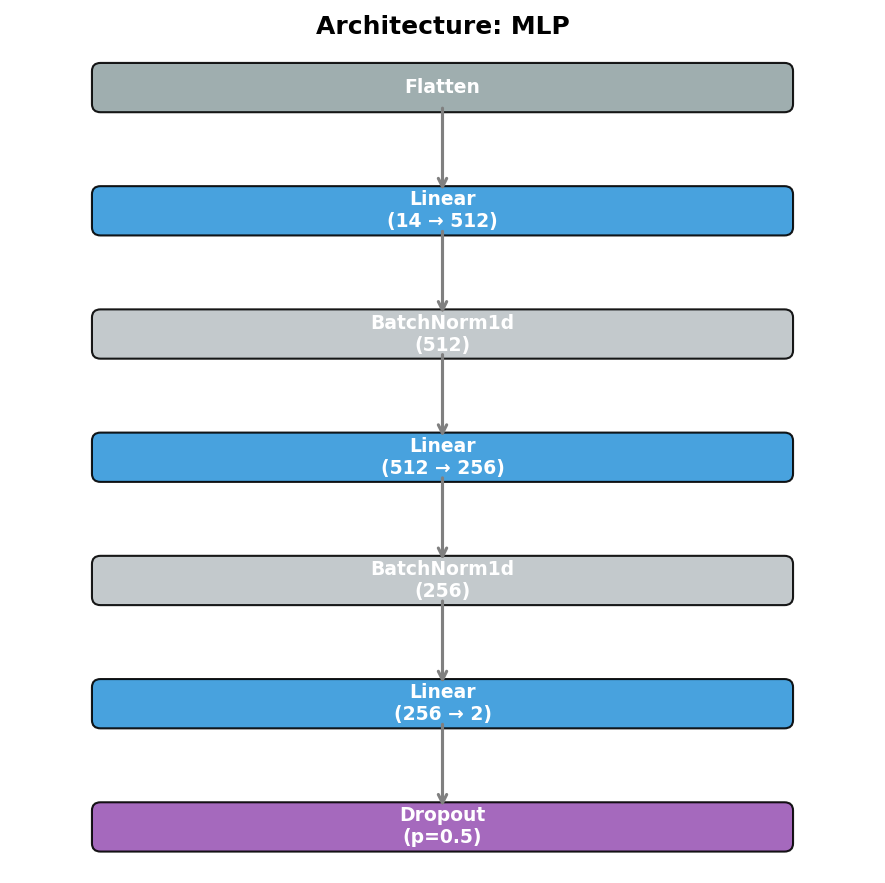

# UCI Adult Income Prediction

The UCI Adult Income dataset is based on U.S. Census data. The goal is to predict whether an individual's income exceeds $50K/year based on attributes such as age, education, occupation, and more.

## Custom Dataset Handling

This example features a unique `adult_dataset.py` file. Unlike standard datasets in `torchvision`, this dataset requires manual loading and preprocessing:

- **CSV Processing:** Automatically downloads and cleans data using `pandas`.
- **Handling Missing Values:** Drops rows with missing (`?`) attributes.
- **Categorical Encoding:** Uses `sklearn.preprocessing.LabelEncoder` to convert strings (e.g., job titles) into numerical categories.
- **Test Set Consistency:** Ensures the test set uses the same category-to-number mappings as the training set.

## Configurations

Inherits from `adult_base.py`, which uses `TabularNormalize` with pre-calculated mean and standard deviation (calculated using the stats mode of this tool!).

### 1. Multi-Layer Perceptron (MLP)

- **Config:** `adult_mlp.py`
- **Details:** Perfectly suited for tabular data. Achieves >98% accuracy in just a few epochs, which can all be run in a few minutes on most GPUs.
- **Command:**

  ```bash
  cd examples/UCIAdultIncome
  python ../../main.py job --config adult_mlp.py
  ```

### 2. Convolutional Neural Network (CNN)

- **Config:** `adult_cnn.py`
- **Details:** **Reshaping Tabular Data:** This example demonstrates how to reshape a 1D vector (14 attributes) into a 2D matrix. Applying a CNN to this dataset is largely unnecessary since MLPs reach an incredible accuracy quickly and are easier to calculate than a CNN.
- **Command:**

  ```bash
  cd examples/UCIAdultIncome
  python ../../main.py job --config adult_cnn.py
  ```

## Visualizations

```bash
python ../../main.py vis --config adult_mlp.py
```

### Metrics & Predictions

| Training Progress |
| :---: |
|  |

### Model Architecture


